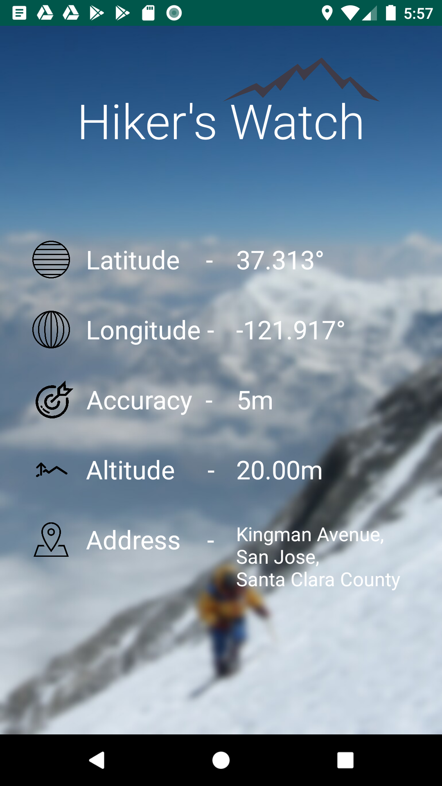

# android_hikers_watch
Hello. This is a simple android GPS app. This app will use GPS to give you the longitude, latitude, accuracy and the altitude(if available)
When internet connection is available it will give you the address of your current position.

You can use this to learn about,
 - How to use LocationManager to get the GPS data
 - How to use Geocoder to get the data about the location.

Feel free to change this app and use in your own applications. 

Thank you

I used [unsplash](https://unsplash.com/) to download the background image.

[Oreo Development Course](https://www.udemy.com/share/101Y5MAkMcdl5bRXo=/)
